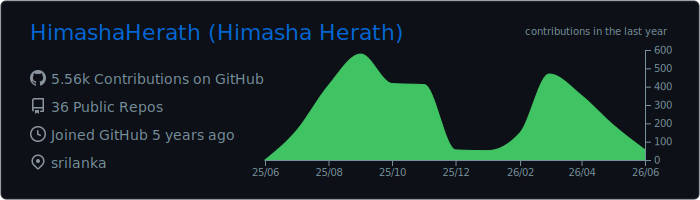
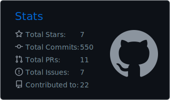
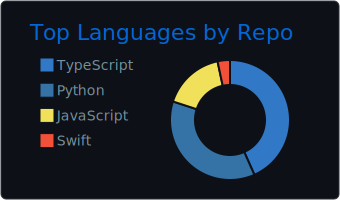
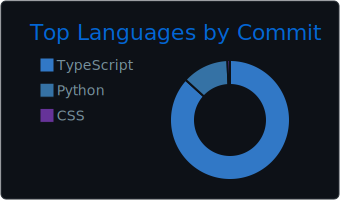
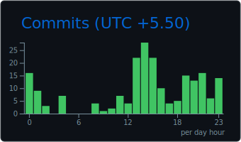

<!--
  GitHub Profile README for HimashaHerath
  Clean, professional, low-friction version.
-->

<h1 align="center">Hi, I'm Himasha Herath</h1>

<p align="center">
  <strong>Full Stack Engineer · AI & Web Solutions · Next.js / TypeScript / Python</strong>
</p>

<p align="center">
  I build practical software products, AI-assisted workflows, developer tools, and clean web experiences.
</p>

<p align="center">
  <a href="https://himasha.tech">
    
  </a>
  <a href="https://www.linkedin.com/in/himasha-herath">
    
  </a>
  <a href="mailto:himasha626@gmail.com">
    
  </a>
</p>

---

## About

I'm a software engineer from Sri Lanka focused on building useful, production-minded systems with clean interfaces and strong engineering foundations.

My work usually sits around:

- AI-integrated products and LLM-powered workflows
- Full-stack web apps with Next.js, React, TypeScript, and Python
- Developer tooling, automation, dashboards, and internal systems
- E-commerce, SaaS, and practical business software

I care about shipping fast, keeping architecture understandable, and building things that can actually be used - not just demoed.

---

## Current Focus

<table>
  <tr>
    <td width="50%">
      <h3>AI + Product Engineering</h3>
      <p>Building practical AI-assisted tools, memory systems, automation layers, and intelligent workflows.</p>
    </td>
    <td width="50%">
      <h3>Full-Stack Systems</h3>
      <p>Designing clean web apps, APIs, dashboards, admin tools, and product interfaces with modern web stacks.</p>
    </td>
  </tr>
  <tr>
    <td width="50%">
      <h3>Developer Infrastructure</h3>
      <p>Working with GitHub Actions, Docker, MCP-style tooling, Discord automation, and reliable integration flows.</p>
    </td>
    <td width="50%">
      <h3>Business Software</h3>
      <p>Turning real operational needs into simple, maintainable tools for teams, brands, and small businesses.</p>
    </td>
  </tr>
</table>

---

## Tech Stack

<p align="center">
  
</p>

<p align="center">
  
  
  
  
</p>

---

## Selected Work

<table>
  <tr>
    <td width="50%">
      <h3><a href="https://github.com/HimashaHerath/discord-llm">Discord Control Layer</a></h3>
      <p>MCP-ready Discord control plane for bots, tools, and project automation.</p>
      <p><code>TypeScript</code> <code>Discord</code> <code>MCP</code> <code>Docker</code></p>
    </td>
    <td width="50%">
      <h3><a href="https://github.com/HimashaHerath/github-dev-wrapped">GitHub Dev Wrapped</a></h3>
      <p>AI-powered weekly GitHub activity reports and developer summaries.</p>
      <p><code>TypeScript</code> <code>GitHub Actions</code> <code>AI</code></p>
    </td>
  </tr>
  <tr>
    <td width="50%">
      <h3><a href="https://github.com/HimashaHerath/CortexFlow">CortexFlow</a></h3>
      <p>Experiments around LLM memory, context handling, and retrieval workflows.</p>
      <p><code>Python</code> <code>LLMs</code> <code>LangChain</code></p>
    </td>
    <td width="50%">
      <h3><a href="https://github.com/HimashaHerath">More Projects</a></h3>
      <p>Web apps, automation tools, AI experiments, dashboards, and product prototypes.</p>
      <p><code>Next.js</code> <code>Python</code> <code>Docker</code></p>
    </td>
  </tr>
</table>

---

## GitHub Overview

<p align="center">
  
</p>

<p align="center">
  
  
</p>

<p align="center">
  
  
</p>

---

## How I Work

```txt
Think clearly -> build fast -> verify properly -> simplify aggressively
```

I prefer small, focused systems over over-engineered ones.
I like tools that save time, interfaces that are easy to understand, and codebases that are maintainable after the first version ships.

---

<p align="center">
  <strong>Open to software engineering, AI product, full-stack, and automation-focused opportunities.</strong>
</p>
